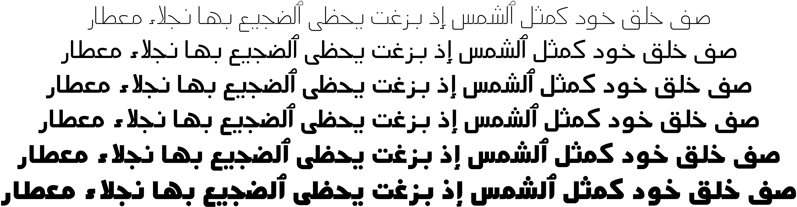

Mada
====



Mada is a modernist, unmodulted Arabic typeface inspired by Cairo road signage.
Mada is characterised by low descenders, open contours and low contrast forms
making it suitable for small point sizes, user interfaces, signage or low
resolution settings.

Mada can work also as a display typeface giving modernist and simplistic feeling.

Mada comes in 5 weights (Light, Regular, SemiBold, Bold and Black).

Building
--------

You need GNU Make and a few Python packages. To install the Python
requirements, run:
```shell
pip install -r requirements.txt
```

Then to build the OTF fonts:
```shell
make otf
```

Or the TTF ones:
```
make ttf
```
