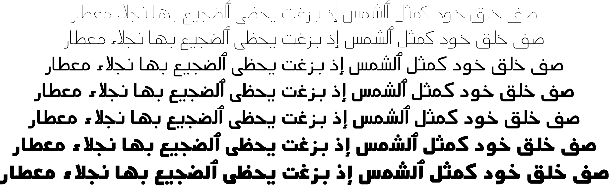

Mada
====

Mada is a modernist, unmodulted Arabic typeface inspired by Cairo road signage.
Mada is characterised by low descenders, open contours and low contrast forms
making it suitable for small point sizes, user interfaces, signage or low
resolution settings. Mada can work also as a display typeface giving modernist
and simplistic feeling.

Mada currently comes in three weights, thin, medium and black. More weights
might be added in the future.
