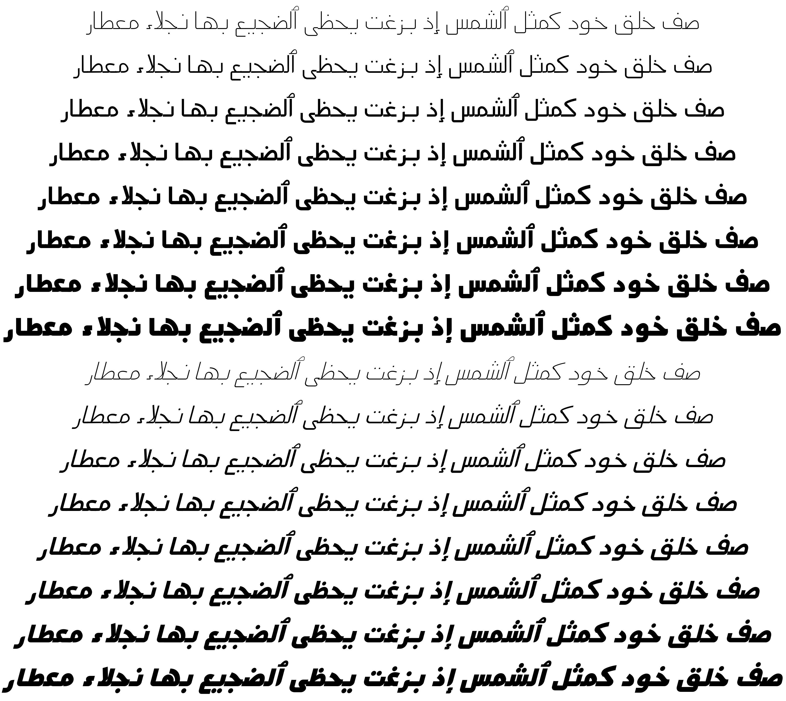

Mada
====

Mada is a modernist, low contrast Arabic typeface based largely on the typeface
seen in Cairo metro old signage which was designed by [Professor Fathi
Gouda](https://www.facebook.com/FathiGouda/) of Faculty of Applied Arts, Helwan
University.

Mada is characterised by low descenders, open contours and low contrast forms
making it suitable for small point sizes, user interfaces, signage or low
resolution settings.

Mada can work also as a display typeface giving modernist and simplistic feeling.

Mada comes in 7 weights (ExtraLight, Light, Regular, Medium, SemiBold, Bold and
Black), as well as an interpolatable variable font that can provide any
intermediate weight on the fly.

Building
--------

If you are building from cloned Git repository, you will need to update the git
sub modules:

    git submodule update --init

You need GNU Make and a few Python packages. To install the Python
requirements, run:

    pip install -r requirements.txt

Then to build the fonts:

    make otf # CFF-flavoured fonts
    make ttf # TTF-flavoured fonts
    make vf  # Variable font, TTF-flavoured
