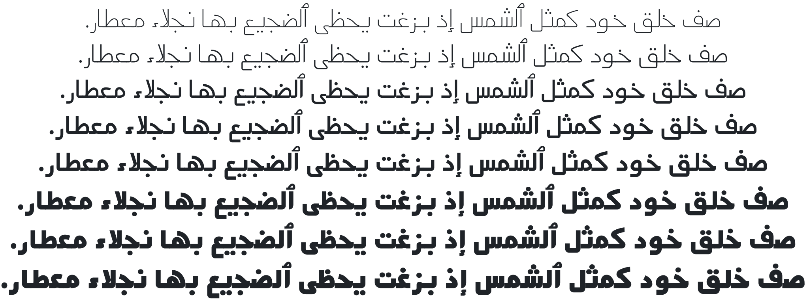

Mada
====

_Mada_ (مدى) is a modernist, low contrast Arabic typeface based largely on the
typeface seen in Cairo metro old signage which was designed by Professor _Fathi
Gouda_ of the Faculty of Applied Arts, Helwan University.

_Mada_ is characterised by low descenders, open contours and low contrast forms
making it suitable for small point sizes, user interfaces, signage or low
resolution settings.

_Mada_ can work also as a display typeface giving modernist and simplistic
feeling.

_Mada_ is [variable font][1] that has all the font weights in the same file,
and allow dynamic changes of the font weight. Font weights supported by _Mada_
range from Extra Light to Black.

The Latin part of _Mada_ taken from [Source Sans][2] by Paul D. Hunt.

Building
--------

You need GNU Make and a few Python packages. To install the Python
requirements, run:

    pip install -r requirements.txt

Then to build the fonts:

    make otf # CFF-flavoured fonts
    make ttf # TTF-flavoured fonts

[1]: https://web.dev/variable-fonts
[2]: https://github.com/adobe-fonts/source-sans
